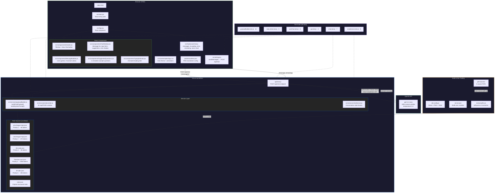

# Pro Court Rules — Application Architecture

```mermaid
flowchart TB
    subgraph Browser["Browser (PWA)"]
        direction TB
        HTML["index.html"]
        Main["src/main.jsx<br/>React entry point"]
        App["src/App.jsx<br/>Root component"]
        
        subgraph Components["React Components"]
            Header["src/components/Header.jsx<br/>Title bar + New Chat button"]
            ChatWindow["src/components/ChatWindow.jsx<br/>Message list, input form,<br/>suggestions, error display"]
            MessageBubble["src/components/MessageBubble.jsx<br/>User (green) / Assistant (dark)"]
            Suggestions["src/components/SuggestedQuestions.jsx<br/>6 clickable example questions"]
            Typing["src/components/TypingIndicator.jsx<br/>Animated loading dots"]
        end

        Hook["src/hooks/useChat.js<br/>messages, isLoading, error,<br/>remaining, send, reset"]
        FetchWrapper["src/utils/api.js<br/>sendMessage() → POST /api/chat"]
        CSS["src/assets/styles/App.css<br/>Dark theme + animations"]
        Manifest["public/manifest.json<br/>PWA standalone config"]
    end

    subgraph Vercel["Vercel Serverless"]
        direction TB
        Handler["api/chat.js<br/>POST /api/chat endpoint"]
        
        subgraph Services["Service Layer"]
            PayloadBuilder["src/services/payloadBuilder.js<br/>buildChatPayload()<br/>buildSystemPrompt()"]
            RateLimiter["src/services/rateLimiter.js<br/>20 req/IP/24hr window"]
            ChatService["src/services/chatService.js<br/>Conversation state factory"]
        end

        subgraph Data["Rule Sources (src/data/)"]
            PNW["pnw-league-regs.json<br/>Priority 1 · ~6k tokens"]
            USTA["usta-league-regs.json<br/>Priority 2 · ~27k tokens"]
            Code["the-code.json<br/>Priority 3 · ~5k tokens"]
            FACT["friend-at-court.json<br/>Priority 4 · ~155k tokens"]
            ITF["itf-rules.json<br/>Priority 5 · ~20k tokens"]
            Rules["rules.json<br/>Original structured rules"]
        end
    end

    subgraph OpenAI["OpenAI API"]
        Model["gpt-5.4-nano<br/>400k context window<br/>temperature 0.4"]
    end

    subgraph Tooling["Build & Dev Tooling"]
        Vite["vite.config.js<br/>React + PWA + Vitest"]
        VercelConf["vercel.json<br/>Build cmd, rewrites"]
        Extract["extract-pdfs.cjs<br/>pdf-parse v2 extraction"]
        PDFs["pdf-sources/<br/>5 source PDFs"]
    end

    subgraph Tests["Test Suite (46 tests)"]
        T1["chatService.test.js · 8"]
        T2["payloadBuilder.test.js · 11"]
        T3["rateLimiter.test.js · 8"]
        T4["chat.test.js · 7"]
        T5["api.test.js · 4"]
        T6["useChat.test.js · 8"]
    end

    HTML --> Main --> App
    App --> Hook
    App --> Header
    App --> ChatWindow
    ChatWindow --> MessageBubble
    ChatWindow --> Suggestions
    ChatWindow --> Typing
    Hook --> FetchWrapper

    FetchWrapper -- "POST /api/chat<br/>{messages}" --> Handler
    Handler --> RateLimiter
    Handler --> PayloadBuilder
    PayloadBuilder --> Data
    Handler -- "Authorization: Bearer $KEY<br/>Chat Completions API" --> Model
    Model -- "assistant message" --> Handler
    Handler -- "{message, remaining}" --> FetchWrapper

    PDFs -- "node extract-pdfs.cjs" --> Extract
    Extract -- "JSON output" --> Data

    T1 -.-> ChatService
    T2 -.-> PayloadBuilder
    T3 -.-> RateLimiter
    T4 -.-> Handler
    T5 -.-> FetchWrapper
    T6 -.-> Hook

    style Browser fill:#1a1a2e,stroke:#4caf50,color:#e8e8e8
    style Vercel fill:#1a1a2e,stroke:#0070f3,color:#e8e8e8
    style OpenAI fill:#1a1a2e,stroke:#10a37f,color:#e8e8e8
    style Tooling fill:#1a1a2e,stroke:#f59e0b,color:#e8e8e8
    style Tests fill:#1a1a2e,stroke:#8b5cf6,color:#e8e8e8
    style Components fill:#252525,stroke:#4caf50,color:#e8e8e8
    style Services fill:#252525,stroke:#0070f3,color:#e8e8e8
    style Data fill:#252525,stroke:#0070f3,color:#e8e8e8
```
