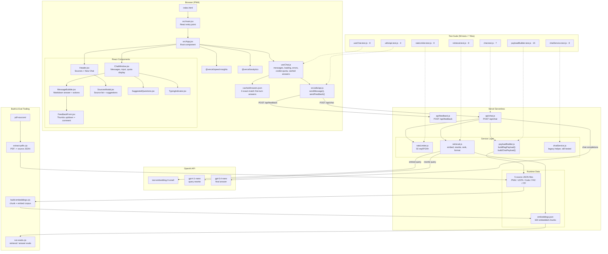

# Pro Court Rules — Application Architecture

## Request Flow

### Chat answers

1. `useChat()` accepts input, checks the browser-side 50/day cookie limit, and short-circuits to `cachedAnswers.json` for exact-match first-turn prompts.
2. `src/utils/api.js` posts the conversation to `POST /api/chat`.
3. `api/chat.js` validates the request, strips non-user/assistant roles, caps history, and applies the server-side in-memory rate limiter.
4. If `src/data/embeddings.json` exists, the server:
   - embeds the recent user query
   - rewrites it into search-style phrases
   - embeds the rewrite
   - retrieves top chunks with a weighted dual-embedding score plus source diversity pass
   - formats those chunks into grouped source context
   - builds a RAG system prompt with source hierarchy instructions
5. The server sends that prompt to `gpt-5.4-nano` and returns `{ message, remaining }`.
6. The client renders the answer as sanitized markdown and exposes copy + feedback actions.

If `embeddings.json` is missing, `api/chat.js` falls back to the older full-context prompt path using the raw source JSON files.

### Feedback

1. `FeedbackForm.jsx` and `SourcesModal.jsx` post structured feedback to `POST /api/feedback`.
2. `api/feedback.js` validates the payload, logs it in a structured format, and optionally forwards it to a Google Sheets webhook.

## Notes

- The primary runtime data path is now **embedded chunk retrieval**, not sending the full corpus on every request.
- `src/services/chatService.js` and `src/data/rules.json` remain in the repo, but they are not part of the main runtime path.
- The rate limit shown in the UI and enforced in the current code is **50/day**, not 20/day.
